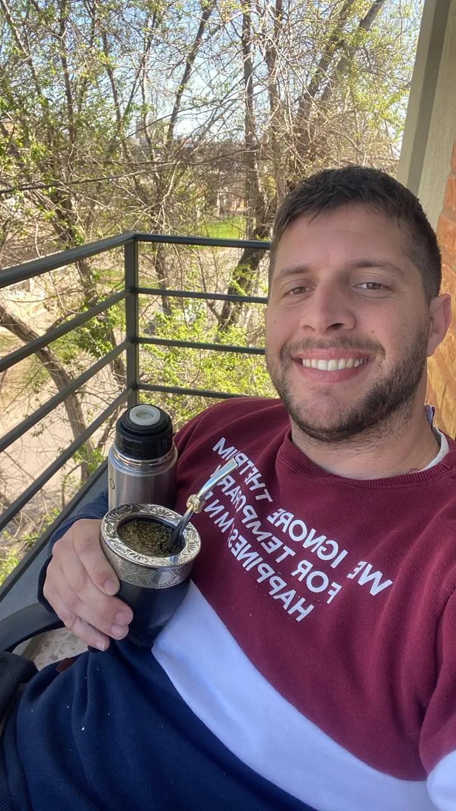

## Hola👋, soy [Camilo Escar](https://camiloescar.vercel.app)!
Estudiante, cursando el último año de la Licenciatura en Sistemas de Información y técnico de redes en Video Digital SRL.
 

 
 
  

<!-- -->
 

<!--

## Lenguajes y Herramientas
-->

### Frontend

<code></code>
<code></code>
<code></code>
<code></code>
<code></code>
<code></code>
 

### Backend

<code></code>
<code></code>
<code></code>
<code></code>
 

<!--
### Infraestructura y herramientas

<code></code>
<code></code>
<code></code>
<code></code>

## Qué estoy haciendo actualmente

- Desarrollando proyectos.
- Estudiante en Licenciatura en Sistemas de Información.
- Practicando algoritmos, estructuras de datos y patrones de diseño.
- Experimentando con IA, bots y automatizaciones.
 

## Estoy abierto a:

- Proyectos freelance
- Desarrollo frontend y full stack
- Integraciones, automatizaciones y APIs
- Construcción de dashboards y visualizaciones
-->
